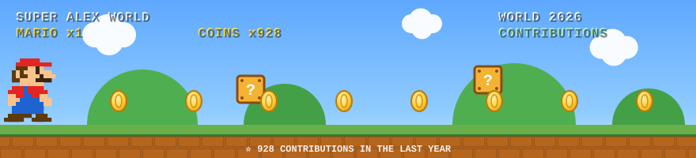

  

  
  
  
  
  
  

  

---

## 🚀 About

I engineer at the intersection of **operational technology and modern software**. After **17+ years in Protection, Control &amp; Automation (P&amp;C)** of high-voltage substations — engineering, commissioning and cybersecurity of critical infrastructure — I now **build the full-stack platforms** that make that work faster, safer and reproducible.

Not just specs and drawings: I ship the code — **FastAPI + React + native protocol tooling** — designed to run **fully local / air-gapped** inside OT environments, with **no cloud dependency**.

- 🏭 **17+ years** in P&amp;C and automation of HV substations (engineering · commissioning · FAT)
- 🔌 **IEC 61850** across the stack — SCL (-6), MMS (-8-1), Sampled Values (-9-2), GOOSE, PTP (1588)
- 🛡️ **OT / ICS cybersecurity** aligned to **IEC 62443** for critical infrastructure
- 🧰 **Full-stack engineer** — I design the domain *and* deliver the software that runs it

---

## 🛠️ Tech Stack

**Languages**

**Backend & APIs**

**Frontend & Desktop**

**OT / Substation Protocols**

**DevOps & Quality**

---

## 💼 Selected Work

> Most of my software is **proprietary / enterprise engineering** built for OT
> environments, so the source lives under NDA rather than on public GitHub.
> Here is what I design and ship end-to-end:

| Project | What it is | Stack |
|---|---|---|
| **NEXGRID Platform** | Engineering workbench for **IEC 61850** substation automation — SCL/GOOSE/SMV topology mapping, protection-twin relay simulation, COMTRADE oscillography, OT syslog supervision. Runs fully air-gapped. | FastAPI · React · TypeScript · lxml |
| **IEC 61850 Toolchain** | SCL (SSD/SCD/CID) parsing, merge &amp; validation; GOOSE/SMV mapping and FAT test design generators. | Python · C# / .NET · WPF |
| **UR Relay Config Suite** | Config generation for GE UR protection relays (Create / Replicate) from engineering data → validated `.cid`/`.scd`. | Python · openpyxl · lxml |
| **GridLog (OT Syslog)** | Purpose-built OT syslog collector — RFC 3164/5424/Cisco parsing, bounded ring store, live dashboards, SSE streaming. | FastAPI · asyncio · D3 |

---

## 🎮 Contribution World

  

<i>Every coin is a commit. 🍄 The counter tracks my last-year contributions.</i>

---

## 🧭 Engineering Philosophy

> **Technology should make complex engineering simpler — and critical
> infrastructure safer.** I bridge power-systems engineering and software
> development to build tools that help engineers design, validate and secure
> digital substations with confidence.

Principles I ship by: **readable over clever · secure over convenient ·
small, traceable increments · nothing is done without its docs.**

---

## 🤝 Connect

  
  
  
  

🌐 <a href="https://alexjustino.github.io">alexjustino.github.io</a> · 💼 <a href="https://www.linkedin.com/in/alex-justino/">linkedin.com/in/alex-justino</a>

  

